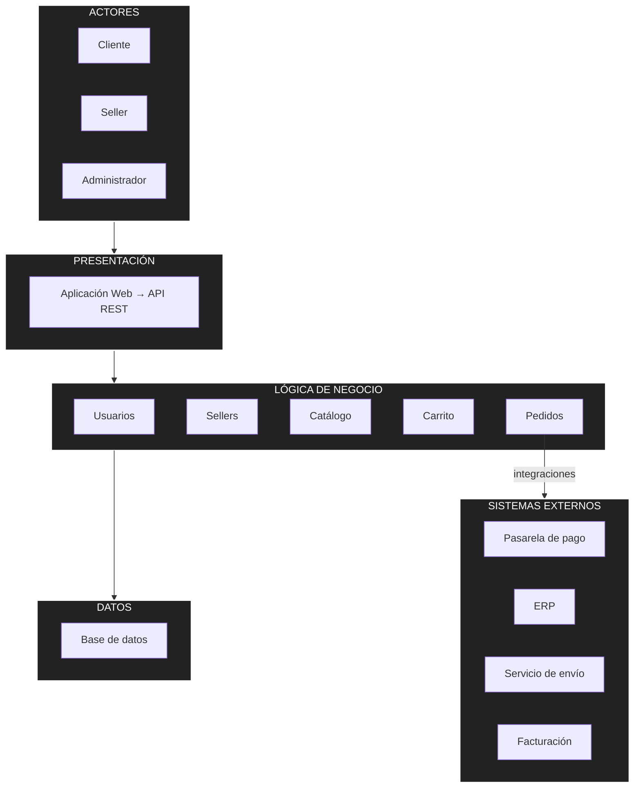

# Arquitectura inicial del sistema

## Arquitectura en tres capas

| Capa | Pregunta que responde | Módulos / Elementos |
|---|---|---|
| Presentación | ¿Cómo interactúa el usuario? | Aplicación Web, API REST |
| Lógica de negocio | ¿Qué hace el sistema? | Usuarios, Sellers, Catálogo, Carrito, Pedidos |
| Datos | ¿Dónde se almacena la información? | Base de datos |

El módulo **Pedidos** es el que concentra las integraciones externas: se comunica con
la pasarela de pago, el servicio de envío, el ERP y el servicio de facturación.

## Diagrama de arquitectura

## Descripción

La arquitectura inicial se organiza en tres capas principales:

- **Presentación:** permite la interacción de los usuarios (Cliente, Seller,
  Administrador) con el sistema mediante la aplicación web y la API REST.
- **Lógica de negocio:** contiene los módulos responsables de las funcionalidades
  del sistema: usuarios, sellers, catálogo, carrito y pedidos.
- **Datos:** permite almacenar y consultar la información mediante una base de datos.

Además, el módulo de **Pedidos** se integra con sistemas externos como la pasarela
de pago, el ERP, el servicio de envío y el servicio de facturación, ya que es el
módulo donde confluyen todas las operaciones que dependen de terceros.
